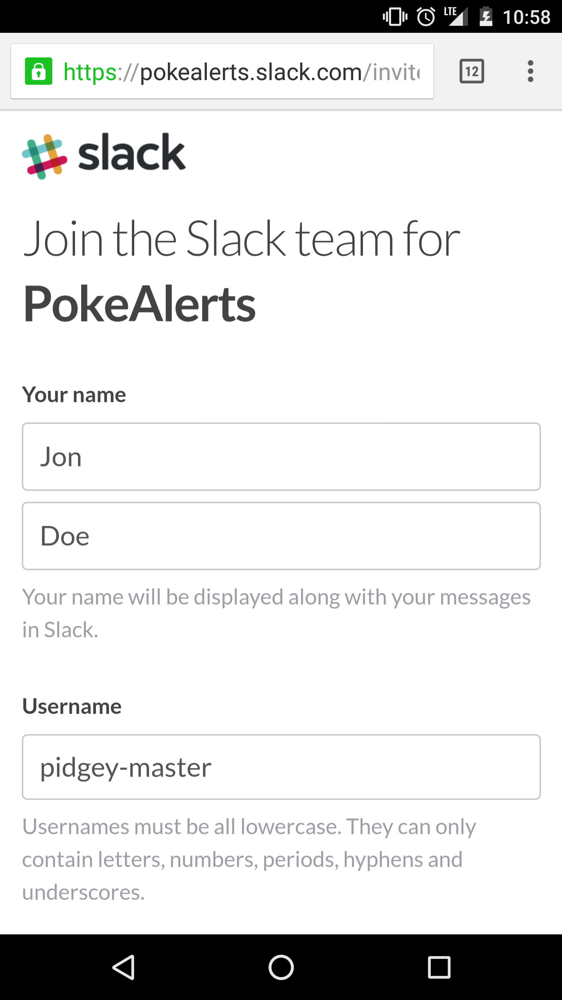
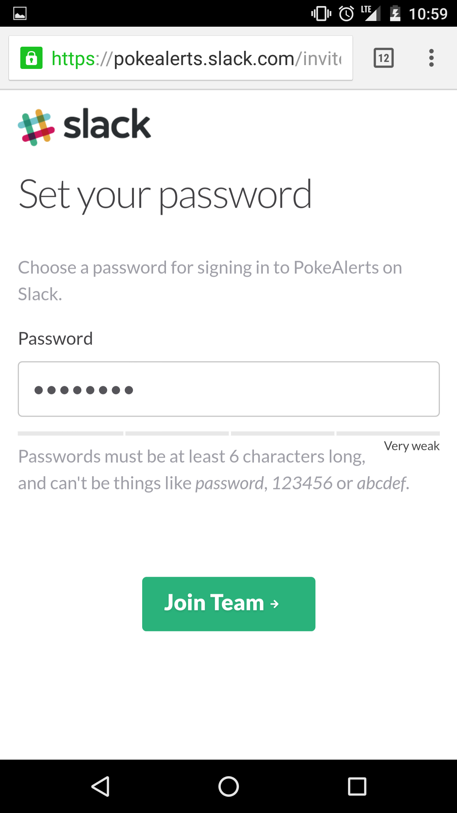
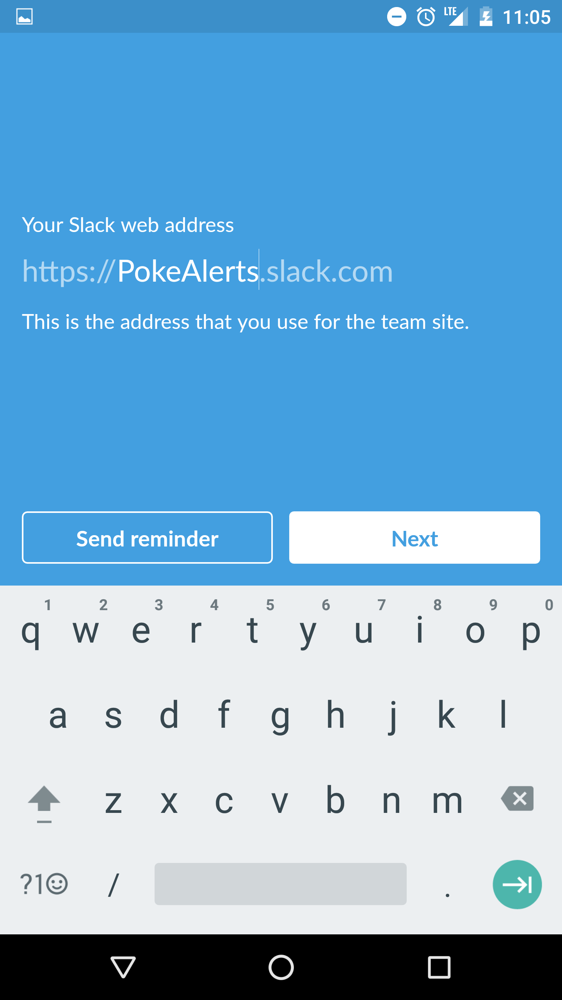
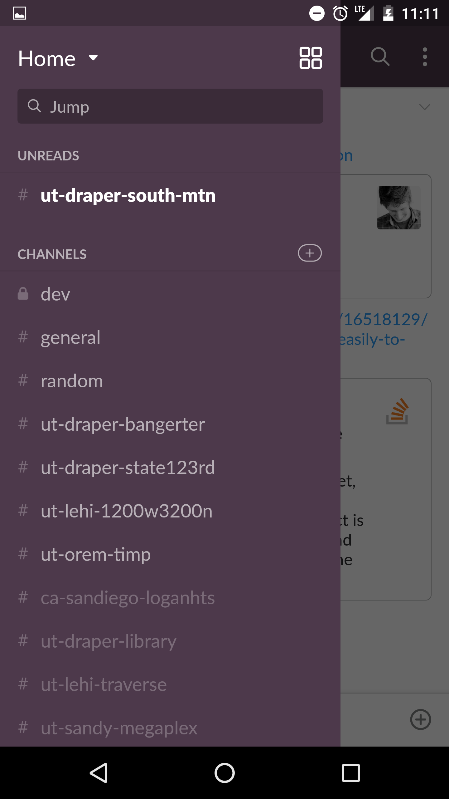
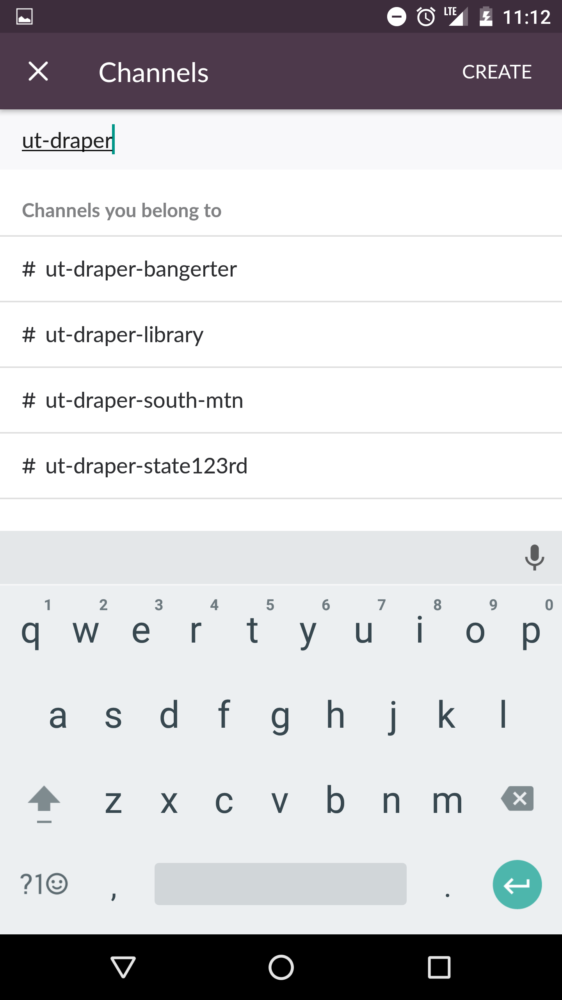

# PokeAlerts

"Gotta catch 'em all" - John F. Kennedy

# Contents

 - [How do I sign up?](#sign-up)
 - [Which Pokemon are filtered out?](#pokemon-lists)
 - [How do I get notifications? How do I join channels?](#joining-channels)
 - [What areas have alerts now? Can I request a new channel?](#channels)
 - [Can you put bots in my area?](#can-you-put-bots-in-my-area)
 - [How can I help?](#helping-out)

# Sign up

You can request an invite [here](https://pokealerts-invite.herokuapp.com/)

### Part 1 - Create Account

- Join the Slack team from the link in your email
- Create an account (you don't need to use your real name)
- Create a password

### Part 2 - Download App

* Download the Slack app onto your phone
* If you are already on your phone, just follow the link provided

### Part 3 - Sign into PokeAlerts

- Sign in to PokeAlerts.slack.com (it will autofill the *.slack.com* part)
- It will ask for your
	- Email (that you recieved the invite on)
	- Password (that you made in Part 1)

### You're in!

# Joining Channels

Pick which channels to recieve pokemon alerts for

- Open the menu (swipe from the left edge of your screen towards the center)
- Open the available channels (click that little +)
- Search for  locations near you
	- Channel naming convention is [ST]-[CITY]-[AREA]
	- See examples below

# Pokemon Lists

## Super Awesome List

These Pokemon give an @channel notification when found

You can turn a channel notification prefrences to "Mentions of my name or highlight words" and still get notified

- Venusaur
- Charizard
- Blastoise
- Machamp
- Muk
- Exeggutor
- Gyarados
- Lapras
- Porygon
- Aerodactyl
- Snorlax
- Articuno
- Zapdos
- Moltres
- Dragonite
- Mewtwo
- Mew

## Filtered List

These Pokemon do not show up on any alerts currently

- Weedle
- Kakuna
- Caterpie
- Metapod
- Pidgey
- Pidgeotto
- Pidgeot
- Rattata
- Raticate
- Spearow
- Ekans
- Pikachu
- Sandshrew
- NidoranMale
- Nidorino
- NidoranFemale
- Nidorina
- Clefary
- Vulpix
- Jigglypuff
- Zubat
- Golbat
- Oddish
- Paras
- Parasect
- Venonat
- Venomoth
- Diglett
- Dugtrio
- Meowth
- Mankey
- Primeape
- Growlithe
- Machop
- Abra
- Kadabra
- Bellsprout
- Geodude
- Graveler
- Ponyta
- Rapidash
- Onix
- Drowzee
- Hypno
- Rhyhorn
- Rhydon
- Cubone
- Eevee
- Magnemite

# Channels

## Current Channels

Attempting to go North to South here

- SLC
	- Gateway
		- \#ut-slac-gateway
		- [Map Boundaries](http://s2map.com/#order=latlng&mode=polygon&s2=false&points=40.775764,-111.909571%0A40.751841,-111.909571%0A40.751841,-111.870003%0A40.775764,-111.870003%0A40.775764,-111.909571%0A)
	- UofU campus
		- \#ut-slc-uofucampus
		- [Map Boundaries](http://s2map.com/#order=latlng&mode=polygon&s2=false&points=40.775764,-111.870003%0A40.751841,-111.870003%0A40.751841,-111.825000%0A40.775764,-111.825000%0A40.775764,-111.870003)
	- Sugarhouse
		- \#ut-slc-sugarhouse
		- [Map Boundaries](http://s2map.com/#order=latlng&mode=polygon&s2=false&points=40.751841,-111.902618%0A40.751841,-111.825000%0A40.718510,-111.825000%0A40.718510,-111.902618%0A40.751841,-111.902618)
	- Glendale
		- \#ut-slc-glendale
		- [Map Boundaries](http://s2map.com/#order=latlng&mode=polygon&s2=false&points=40.704054,-111.972772%0A40.741695,-111.972772%0A40.741695,-111.902619%0A40.704054,-111.902619%0A40.704054,-111.972772)
- Taylorsville
	- \#ut-taylorsville
	- [Map Boundaries](http://s2map.com/#order=latlng&mode=polygon&s2=false&points=40.704054,-111.952772%0A40.641695,-111.952772%0A40.641695,-111.902619%0A40.704054,-111.902619%0A40.704054,-111.952772)
- Millcreek
	- West
		- \#ut-millcreek-west
		- [Map Boundaries](http://s2map.com/#order=latlng&mode=polygon&s2=false&points=40.718510,-111.902618%0A40.718510,-111.804322%0A40.686496,-111.804322%0A40.686496,-111.902618%0A40.718510,-111.902618%0A)
- South Jordan
	- Parkway
		- \#ut-southjordan-pkwy
		- [Map Boundaries](http://s2map.com/#order=latlng&mode=polygon&s2=false&points=40.561717,-111.929290%0A40.544389,-111.896974%0A)
- Riverton
	- District
		- \#ut-riverton-district
		- [Map Boundaries](http://s2map.com/#order=latlng&mode=polygon&s2=false&points=40.54433150215254,-111.98442980647087%0A40.52241298300752,-111.93885371088982%0A)
- Herriman
	- \#ut-herriman
	- [Map Boundaries](http://s2map.com/#order=latlng&mode=polygon&s2=false&points=40.522245,-112.054809%0A40.4805069,-111.995847%0A)
- Sandy
	- Ft Union
		- \#ut-sandy-ftunion
		- [Map Boundaries](http://s2map.com/#order=latlng&mode=polygon&s2=false&points=40.60884469309,-111.85946829%0A40.57939488923,-111.803757827%0A)
	- Megaplex
		- \#ut-sandy-megaplex
		- [Map Boundaries](http://s2map.com/#order=latlng&mode=polygon&s2=false&points=40.595500,-111.89100%0A40.558906,-111.85146%0A)
	- Alta High
		- \#ut-sandy-altahigh
		- [Map Boundaries](http://s2map.com/#order=latlng&mode=polygon&s2=false&points=40.559000,-111.89100%0A40.544272,-111.83893%0A)
- Draper
	- State 123rd
		- \#ut-draper-state123rd
		- [Map Boundaries](http://s2map.com/#order=latlng&mode=polygon&s2=false&points=40.544272,-111.89100%0A40.527272,-111.83893%0A)
	- Corner Canyon
		- \#ut-draper-cornercnyn
		- [Map Boundaries](http://s2map.com/#order=latlng&mode=polygon&s2=false&points=40.527272,%0A-111.89100%0A40.501000,%0A-111.83893%0A)
	- South Mountain
		- \#ut-draper-south-mtn
		- [Map Boundaries](http://s2map.com/#order=latlng&mode=polygon&s2=false&points=40.501000,%0A-111.89100%0A40.4834171,%0A-111.83893%0A%0A)
	- Bangerter
		- \#ut-draper-bangerter
		- [Map Boundaries](http://s2map.com/#order=latlng&mode=polygon&s2=false&points=40.516099,%0A-111.909914%0A40.503635,%0A-111.889658%0A)
- Lehi
	- Traverse
		- \#ut-lehi-traverse
		- [Map Boundaries](http://s2map.com/#order=latlng&mode=polygon&s2=false&points=40.4520814,%0A-111.915344%0A40.432689,%0A-111.849591%0A)
	- 1200W 3200N
		- \#ut-lehi-1200w3200n
		- [Map Boundaries](http://s2map.com/#order=latlng&mode=polygon&s2=false&points=40.432689,%0A-111.915344%0A40.412954,%0A-111.849591%0A%0A)
	- Downtown
	 	- \#ut-lehi-downtown
	 	- [Map Boundaries](http://s2map.com/#order=latlng&mode=polygon&s2=false&points=40.412105,-111.906867%0A40.386548,-111.829019)
- Highland
	- North/Central
		- \#ut-highland
		- [Map Boundaries](http://s2map.com/#order=latlng&mode=polygon&s2=false&points=40.412954%0A-111.8495%0A40.432689%0A-111.7731)
	- South
		- \#ut-highland-south
		- [Map Boundaries](http://s2map.com/#order=latlng&mode=polygon&s2=false&points=40.412954,%0A-111.829019%0A40.386548,%0A-111.7731)
	- Alpine
		- \#ut-alpine
		- [Map Boundaries](http://s2map.com/#order=latlng&mode=polygon&s2=false&points=40.470728,%0A-111.82091%0A40.432689,%0A-111.74786)
	- Cedar Hills
		- \#ut-cedarhills
		- [Map Boundaries](http://s2map.com/#order=latlng&mode=polygon&s2=false&points=40.432689,%0A-111.7731%0A40.391787,%0A-111.736815)
- American Fork
	- 500 East
		- \#ut-af-500east
		- [Map Boundaries](http://s2map.com/#order=latlng&mode=polygon&s2=false&points=40.386548,-111.814384%0A40.333030,-111.759453%0A%0A)
- Orem
	- Timpanogas
		- \#ut-orem-timp
		- [Map Boundaries](http://s2map.com/#order=latlng&mode=polygon&s2=false&points=40.333623,%0A-111.72924%0A40.311636,%0A-111.66512%0A)
	- Provo
		- \#ut-orem-provo
		- [Map Boundaries](http://s2map.com/#order=latlng&mode=polygon&s2=false&points=40.298123574,%0A-111.7550486%0A40.210869665,%0A-111.6288480%0A)
	- BYU
		- \#ut-provo-byu
		- [Map Boundaries](http://s2map.com/#order=latlng&mode=polygon&s2=false&points=40.273156,%0A-111.694875%0A40.225805,%0A-111.624613%0A)

## Roadmap

In no particular order yet...

- West Valley
- Saratoga Springs
- Daybreak
- Layton
- Midvale
- Murray

# Can you put bots in my area?

Yes! However, keep in mind our top priority is keeping the current bots running.  Niantic is constantly trying to murder them and breaking everything.

## How can I help my area get bots?

Great question!

We need a couple things to set up a new zone:

1. Channel name 
	- We're trying to use this naming convention \#[ut]-[city]-[area]
	- Look at the current examples above as a reference
2. Map boundries
	- We need lat/long boundries
	- Use the current [Millcreek Map](http://s2map.com/#order=latlng&mode=polygon&s2=false&points=40.718510,-111.902618%0A40.686496,-111.804322) as a reference
		- This tool isn't very user friendly but it draws a box given the top-right and bottom-left corners
		- If you find a better online tool for this, let us know!
	- Try to make your new zone roughly that size 
	- **Super Bonus Internet Points** if your new zone right next to a current one
		- Reference the [Channels section](#channels) above for nearby places to your zone
		- Put your lat/long boundries on the boundries of other current zone(s) 
		- Example: the upper bound of Millcreek is the lower bound for Sugarhouse
		- We will probably ignore zone requests that are overlapping current zone(s) (slight overlap on a border is acceptable)
		- We will likely prioritize new zone requests that nicely border existing zones

Continuing with the Millcreek as an example, you would deliver 2 things:

1. Channel name = \#ut-millcreek-west  
2. Map link = [This link](http://s2map.com/#order=latlng&mode=polygon&s2=false&points=40.718510,-111.902618%0A40.686496,-111.804322)

No promises that we can get your zone up, but doing this for us will make it **MUCH** more likely that we will

# Helping Out

## Supporting the Community

So far the chat and comments have been positive and helpful.  Help us keep it that way!
If we don't have to babysit the chat then we get to spend time doing awesome things for this! 
Helping new users get started and answering questions also takes a lot off of our plate.

## Spreading the Good Word

We're excited to share this with more people.  If you know someone who will use this, invite them!

## Donating

We're just some guys that wanted to share our cool Snorlax + Dragonite finder.  
Any donations will help **a ton** as we're currently building this with our own time and money.  
You can donate with the **Paypal** Button above or to the **Venmo** account @PokeAlerts.

We're excited to expand this to new regions and add better features.

**Thank you for all the support!**
